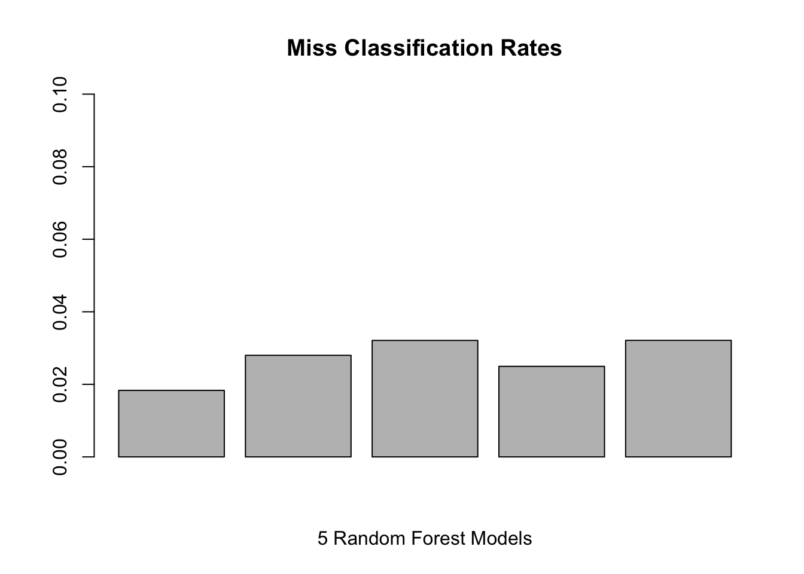

# Health_Prediction

```
## Loading required package: lattice
```

```
## Loading required package: ggplot2
```

```
## Loading required package: foreach
```

```
## Loading required package: iterators
```


## Cleaning Data
First we clean the data and remove predictors that have very little or no influence on our predicted classification "Classe".  **Transformations are applied to both training and test data.**

First we identify **columns that have more than 50% NA's** since those columns will not be able to help give an accurate prediction. 


```r
NA_percent <- numeric()
for(i in 1:160){
    NA_percent[i] <- round(sum(is.na(training[,i])) / 19622 ,3)
}
table(NA_percent)
```

```
## NA_percent
##     0 0.979 
##    93    67
```
Looking at this table, there are 67 columns that have 97.9% NA's, which means they might as well be empty so we will remove them.

Then we will use Caret's **Near Zero** function get rid of useless columns. 
In the end, we have **54 columns** that will be used for training.

```r
# Identify columns that have more than 50% NA's
col_omit <- colnames(training)[colSums(is.na(training)) > 9811]
col_num <- which(names(training) %in% col_omit)
training2 <- training[,-col_num]
testing2 <- test[,-col_num]
# Get rid of near zero columns
omit <- nearZeroVar(training2)
training3 <- training2[,-omit]
testing3 <- testing2[,-omit]

#Verify there are no NA's in data
sum(is.na(training3))
sum(is.na(testing3))
training4 <- training3[,-c(1:5)]
testing4 <- testing3[,-c(1:5)]
```

## Building The Model
Of the different classification methods, GLM, rpart, knn ran errors, so we'll resort to Random Forests which happens to be better at running larger amounts of data. 


```r
training4$classe <- as.factor(training4$classe)

model1 <- train(classe~.,data = training4, method = "rf", allowParallel = TRUE)
print(model1$finalModel)
```

```
## 
## Call:
##  randomForest(x = x, y = y, mtry = param$mtry, allowParallel = TRUE) 
##                Type of random forest: classification
##                      Number of trees: 500
## No. of variables tried at each split: 27
## 
##         OOB estimate of  error rate: 0.14%
## Confusion matrix:
##      A    B    C    D    E  class.error
## A 5578    1    0    0    1 0.0003584229
## B    5 3788    3    1    0 0.0023702923
## C    0    5 3417    0    0 0.0014611338
## D    0    0    8 3207    1 0.0027985075
## E    0    0    0    3 3604 0.0008317161
```

## Test Set Answers

```
##  [1] B A B A A E D B A A B C B A E E A B B B
## Levels: A B C D E
```

## Cross Validating and Sample Error
For cross validation purposes we will first break up the data into 10 groups (10 folds).

Since running a model on the entire dataset will take over an hour each time on my computer, I will make a model for each fold and test against the next fold, thus 5 models and 5 tests sets. Train fold 1, test on fold 2. Train fold 3, test on fold 4, etc.


```r
set.seed(1234) #Create the grouping numbers
folds <- createFolds(training4$classe,k = 10)

# Declaring MisClassification function provided by Coursera
missClass = function(values, prediction) {
    sum(prediction != values)/length(values)
}

# Creating 10 Partitions
temp1 <- training4[folds[[1]],]
temp2 <- training4[folds[[2]],]
temp3 <- training4[folds[[3]],]
temp4 <- training4[folds[[4]],]
temp5 <- training4[folds[[5]],]
temp6 <- training4[folds[[6]],]
temp7 <- training4[folds[[7]],]
temp8 <- training4[folds[[8]],]
temp9 <- training4[folds[[9]],]
temp10 <- training4[folds[[10]],]

# Creating 5 models and predictions
fit1 <- train(classe ~. , data = temp1, method = "rf", allowParallel = TRUE)
fit3 <- train(classe ~. , data = temp3, method = "rf", allowParallel = TRUE)
fit5 <- train(classe ~. , data = temp5, method = "rf", allowParallel = TRUE)
fit7 <- train(classe ~. , data = temp7, method = "rf", allowParallel = TRUE)
fit9 <- train(classe ~. , data = temp9, method = "rf", allowParallel = TRUE)
pred1 <- predict(fit1,temp2)
pred3 <- predict(fit3,temp4)
pred5 <- predict(fit5,temp6)
pred7 <- predict(fit7,temp8)
pred9 <- predict(fit9,temp10)
MC <- numeric(0)
MC[1] <- missClass(temp2$classe,pred1)
MC[2] <- missClass(temp4$classe,pred3)
MC[3] <- missClass(temp6$classe,pred5)
MC[4] <- missClass(temp8$classe,pred7)
MC[5] <- missClass(temp10$classe,pred9)
```

Using the Miss Classification function provided from the previous lessons, we'll look at the out of sample error rates for the 5 models compared to the other 5 test sets I created.  


```r
round(MC,3)
```

```
## [1] 0.018 0.028 0.032 0.025 0.032
```

```r
barplot(MC, main = "Miss Classification Rates", ylim=c(0, .1), xlab = "5 Random Forest Models")
```

<!-- -->

```r
mean(MC)
```

```
## [1] 0.02710834
```
**My estimate for out of sample error is 2.7%**
